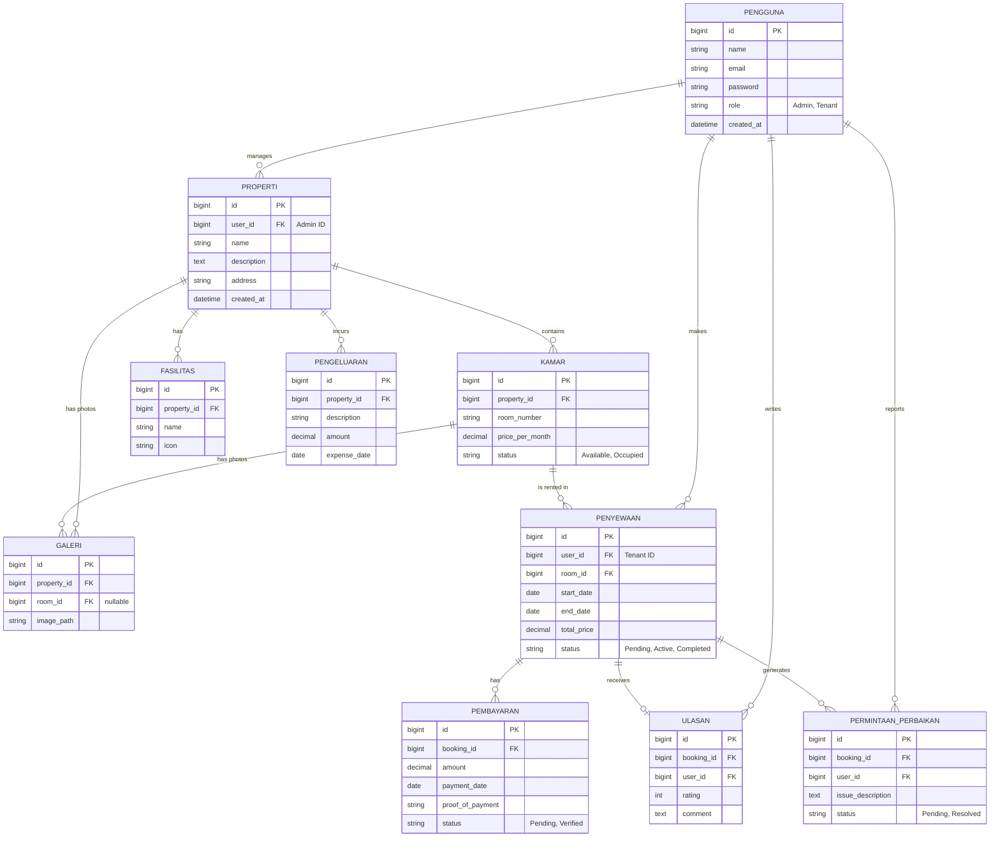

# Product Requirements Document (PRD)
**Project Name:** Aplikasi Sistem Sewa Properti / Kos-kosan
**Role:** Senior Product Manager & Tech Lead
**Date:** 13 Juli 2026
**Status:** Draft / Proposed
**Version:** 1.2

---

## 1. Executive Summary & Product Vision
**Visi Produk:** Menjadi platform digital terpercaya yang menyederhanakan proses pencarian, penyewaan, dan pengelolaan properti (khususnya kos-kosan). 
Aplikasi ini bertujuan untuk menjembatani admin/pengelola kos yang ingin mengelola properti mereka secara efisien dengan pencari kos yang membutuhkan transparansi harga, fasilitas, dan kemudahan transaksi.

**Tujuan Bisnis (Objectives):**
- Mengurangi waktu dan usaha pengelola kos dalam mencatat pembayaran bulanan dan mengelola ketersediaan kamar.
- Memberikan pengalaman pencarian kos yang mulus bagi calon penyewa.
- Mendemokratisasi digitalisasi bagi pengusaha kos-kosan skala kecil hingga menengah.

---

## 2. User Personas & Target Audience
Aplikasi ini dirancang untuk melayani 2 jenis pengguna utama (User Roles):

1. **Penyewa (Tenant / Calon Penyewa):**
   - **Kebutuhan:** Mencari kos berdasarkan lokasi dan harga, melihat detail fasilitas, memesan kamar, dan melacak riwayat pembayaran bulanan.
2. **Administrator Sistem (Admin / Pengelola Kos):**
   - **Kebutuhan:** Menambahkan data properti/kos, mengelola ketersediaan kamar, menyetujui pemesanan, melihat laporan pendapatan, menangani komplain, serta mengawasi aktivitas platform secara keseluruhan.

---

## 3. Key Features Requirements (MVP)
Berikut adalah fitur-fitur utama untuk Minimum Viable Product (MVP):

### 3.1. Authentication & Authorization
- Registrasi dan login multi-role (Admin, Penyewa).
- Manajemen profil pengguna.

### 3.2. Property & Room Management (Khusus Admin)
- Create, Read, Update, Delete (CRUD) Data Kos/Properti (Nama, Deskripsi, Alamat, Fasilitas Umum).
- CRUD Data Kamar (Tipe kamar, Harga per bulan/tahun, Ketersediaan, Foto, Fasilitas Kamar).

### 3.3. Search & Discovery (Khusus Penyewa)
- Halaman katalog properti dengan fitur filter (lokasi, rentang harga, fasilitas).
- Halaman detail kamar beserta status ketersediaan secara *real-time*.

### 3.4. Booking & Transaction (Sewa Menyewa)
- **Pemesanan:** Penyewa dapat melakukan *booking* kamar yang tersedia.
- **Konfirmasi:** Admin dapat menerima atau menolak pesanan.
- **Tagihan (Invoice):** Sistem menghasilkan tagihan bulanan secara otomatis.
- **Pembayaran:** Penyewa dapat mengunggah bukti bayar (manual transfer) atau melalui *Payment Gateway* (opsional untuk MVP).
- **Status Transaksi:** Pending, Menunggu Verifikasi, Lunas, Dibatalkan.

### 3.5. Dashboard & Reporting
- **Admin:** Grafik pendapatan bulanan, jumlah kamar terisi vs kosong, pengingat tagihan jatuh tempo.
- **Penyewa:** Riwayat sewa, tagihan yang belum dibayar.

---

## 4. Data Schema & Architecture

Bagian ini menjelaskan struktur data fundamental yang mendukung aplikasi. Arsitektur database didesain berelasi (RDBMS) untuk menjaga integritas data.

### 4.1. Penjelasan Naratif (Tabel & Relasi)
Aplikasi ini terdiri dari tabel-tabel inti berikut:

1. **`users` (Pengguna):**
   - Menyimpan seluruh data pengguna (Admin, Tenant).
   - Atribut penting: `id`, `name`, `email`, `password`, `role`.
2. **`properties` (Properti/Kos):**
   - Menyimpan data bangunan/kos-kosan. Berelasi *One-to-Many* dari tabel `users` (Satu admin bisa mengelola banyak properti).
   - Atribut penting: `id`, `user_id` (Admin/Pembuat), `name`, `address`, `description`.
3. **`rooms` (Kamar):**
   - Menyimpan rincian kamar. Berelasi *One-to-Many* dari tabel `properties`.
   - Atribut penting: `id`, `property_id`, `room_number`, `price_per_month`, `status` (available, occupied, maintenance).
4. **`bookings` (Pemesanan/Penyewaan):**
   - Mencatat transaksi sewa. Berelasi dari `users` (Penyewa) dan `rooms`.
   - Atribut penting: `id`, `user_id` (Penyewa), `room_id`, `start_date`, `end_date`, `total_price`, `status` (pending, approved, rejected, active, completed).
5. **`payments` (Pembayaran):**
   - Mencatat riwayat pembayaran bulanan/tahunan. Berelasi *One-to-Many* dari `bookings`.
   - Atribut penting: `id`, `booking_id`, `amount`, `payment_date`, `proof_of_payment`, `status` (pending, verified).
6. **`facilities` (Fasilitas):**
   - Menyimpan daftar fasilitas yang disediakan (misal: AC, WiFi, Kamar Mandi Dalam).
   - Atribut penting: `id`, `property_id`, `name`, `icon`, `description`.
7. **`reviews` (Ulasan):**
   - Mencatat ulasan dan rating dari penyewa setelah masa sewa selesai.
   - Atribut penting: `id`, `booking_id`, `user_id`, `rating` (1-5), `comment`.
8. **`galleries` (Galeri Properti/Kamar):**
   - Menyimpan foto-foto properti atau kamar untuk melengkapi katalog.
   - Atribut penting: `id`, `property_id`, `room_id` (opsional), `image_path`, `caption`.
9. **`maintenance_requests` (Pengaduan/Perbaikan):**
   - Menyimpan keluhan/permintaan perbaikan fasilitas (misal: AC rusak) dari tenant.
   - Atribut penting: `id`, `booking_id`, `user_id`, `issue_description`, `status` (pending, in_progress, resolved).
10. **`expenses` (Pengeluaran Operasional):**
   - Menyimpan pencatatan pengeluaran kos-kosan oleh Admin (misal: bayar listrik, air, gaji penjaga).
   - Atribut penting: `id`, `property_id`, `description`, `amount`, `expense_date`.

### 4.2. Visualisasi Entity Relationship Diagram (ERD)

Diagram di bawah ini menggambarkan arsitektur database relasional menggunakan sintaks Mermaid:

---

## 5. Non-Functional Requirements & Tech Stack
- **Backend:** Laravel (PHP). Memanfaatkan Eloquent ORM, Blade Templates (jika monolithic), atau REST API.
- **Frontend UI/UX:** Bootstrap/NiceAdmin Template (responsif dan mobile-friendly).
- **Database:** SQLite (untuk development/testing) atau MySQL/PostgreSQL (untuk production).
- **Security:** CSRF Protection, Password Hashing (Bcrypt), otorisasi berbasis Role (Middleware/Gates).
- **Performance:** Memuat halaman katalog di bawah 2 detik; optimasi query database melalui Eager Loading (`with()`) untuk mencegah N+1 problem.

---
*Dokumen ini merupakan baseline untuk tahapan development. Segala perubahan skema dan fitur akan dilacak melalui sistem version control (Git) dan iterasi selanjutnya.*
